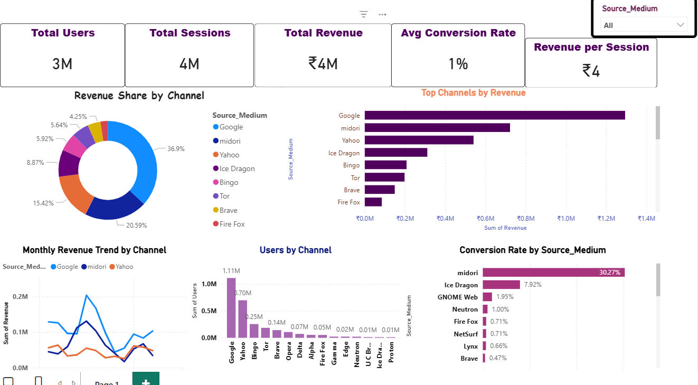

# Digital Web Analytics – Data Cleaning & Performance Analysis

## Project Overview
This project focuses on cleaning, analyzing, and visualizing web analytics data to evaluate digital channel performance.  
The goal is to transform raw web traffic data into meaningful insights using **Python for data cleaning** and **Power BI for interactive dashboarding**, enabling stakeholders to understand user behavior, revenue contribution, and conversion efficiency across channels.

---

## Dataset
The dataset represents web analytics data containing user activity, sessions, transactions, and revenue across different traffic sources.

**Files used:**
- `Web_Analytic_Dataset.csv` – Raw web analytics dataset
- `clean_web_analytics_data.csv` – Cleaned dataset after preprocessing
- `channel_performance_summary.csv` – Aggregated channel-level metrics

---

## Data Cleaning & Preparation (Python)
Data cleaning and preprocessing were performed using Python.

**Key steps:**
- Removed missing and duplicate records
- Standardized column names for consistency
- Converted data types where required
- Created calculated metrics:
  - Conversion Rate
  - Revenue per Session
- Aggregated data at channel and monthly levels for analysis

**Script:**
- `digital_analytics_cleaning.py`

**Tools & Libraries:**
- Python
- pandas
- numpy

---

## Dashboard (Power BI)
An interactive Power BI dashboard was created to visualize key performance indicators and trends.

### Key KPIs
- **Total Users**
- **Total Sessions**
- **Total Revenue**
- **Average Conversion Rate**
- **Revenue per Session**

### Visualizations
- Revenue Share by Channel
- Top Channels by Revenue
- Monthly Revenue Trend by Channel
- Users by Channel
- Conversion Rate by Source Medium
- Interactive slicer for filtering by Source Medium

The dashboard enables quick comparison of traffic sources, identification of high-performing channels, and analysis of revenue and conversion trends over time.

---

## Tools Used
- **Python** (pandas, numpy) – Data cleaning and transformation
- **Power BI** – Data visualization and dashboard creation
- **Git & GitHub** – Version control and project hosting

---

## Output

---

## Key Insights
- Certain traffic sources contribute significantly more to revenue despite lower user volume
- Conversion rates vary widely across channels, highlighting optimization opportunities
- Monthly trends reveal seasonality and performance fluctuations by channel

---

## Conclusion
This project demonstrates an end-to-end analytics workflow: raw data ingestion, data cleaning, metric calculation, and business-focused visualization.  
It showcases practical skills in **data analytics, Python, Power BI, and business insight generation**.

